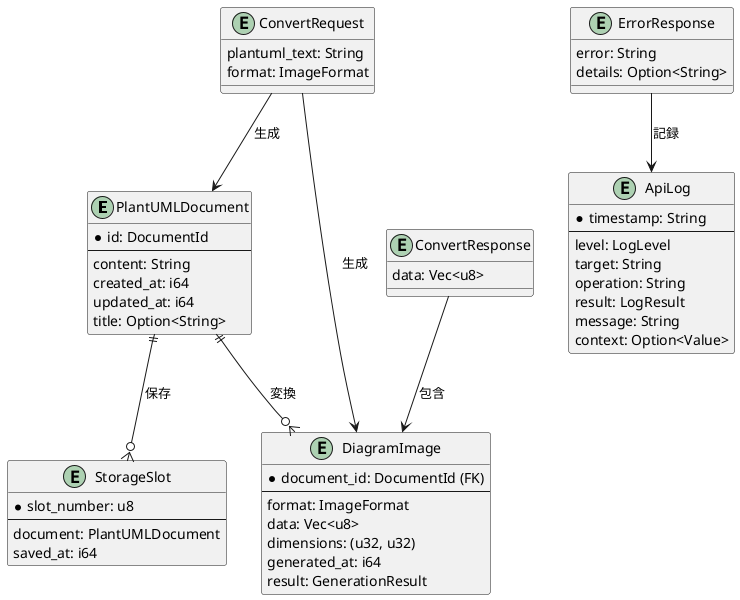

# データモデル定義

**プロジェクト**: 社内向けセキュアなPlantUMLウェブエディタ  
**日付**: 2025-12-15  
**入力**: spec_revised.md (機能仕様)、research.md (技術調査)

## 概要

このドキュメントは、PlantUMLウェブエディタで使用するすべてのエンティティとその関係を定義します。
Rustの型システムを活用し、コンパイル時の型安全性を確保します。

---

## 1. コアエンティティ

### 1.1 PlantUMLDocument

PlantUMLテキストとメタデータを表現するエンティティ。

```rust
/// PlantUMLドキュメント
#[derive(Debug, Clone, serde::Serialize, serde::Deserialize)]
pub struct PlantUMLDocument {
    /// ドキュメントの一意識別子
    pub id: DocumentId,
    
    /// PlantUMLテキスト本体
    pub content: String,
    
    /// 作成日時 (Unix timestamp)
    pub created_at: i64,
    
    /// 最終更新日時 (Unix timestamp)
    pub updated_at: i64,
    
    /// タイトル (オプション、ユーザー入力)
    pub title: Option<String>,
}

/// ドキュメントID (UUID v4)
#[derive(Debug, Clone, Copy, PartialEq, Eq, Hash, serde::Serialize, serde::Deserialize)]
pub struct DocumentId(uuid::Uuid);

impl PlantUMLDocument {
    /// 新規ドキュメント作成
    pub fn new(content: String) -> Self {
        let now = chrono::Utc::now().timestamp();
        Self {
            id: DocumentId(uuid::Uuid::new_v4()),
            content,
            created_at: now,
            updated_at: now,
            title: None,
        }
    }
    
    /// バリデーション
    pub fn validate(&self) -> Result<(), ValidationError> {
        // 空チェック
        if self.content.trim().is_empty() {
            return Err(ValidationError::EmptyContent);
        }
        
        // @startuml/@enduml タグチェック
        if !self.content.contains("@startuml") {
            return Err(ValidationError::MissingStartTag);
        }
        if !self.content.contains("@enduml") {
            return Err(ValidationError::MissingEndTag);
        }
        
        // 文字数上限チェック (300行 × 平均80文字/行 = 24,000文字)
        // 注: パフォーマンス要件は100行だが、余裕を持たせて300行まで許容
        const MAX_CHARS: usize = 24_000;
        if self.content.len() > MAX_CHARS {
            return Err(ValidationError::ContentTooLarge(self.content.len(), MAX_CHARS));
        }
        
        Ok(())
    }
}

#[derive(Debug, thiserror::Error)]
pub enum ValidationError {
    #[error("コンテンツが空です")]
    EmptyContent,
    
    #[error("@startumlタグが見つかりません")]
    MissingStartTag,
    
    #[error("@endumlタグが見つかりません")]
    MissingEndTag,
    
    #[error("コンテンツが大きすぎます: {0}文字 (上限: {1}文字)")]
    ContentTooLarge(usize, usize),
}
```

**関係性**:
- LocalStorageに最大10個保存される
- DiagramImageへの変換リクエストの入力となる

**状態遷移**:
```
[新規作成] → [編集中] → [保存済み] → [再読み込み] → [編集中] ...
           ↓
        [変換リクエスト] → [DiagramImage生成]
```

---

### 1.2 DiagramImage

PlantUMLから生成された図の画像データとメタデータ。

```rust
/// 図の画像データ
#[derive(Debug, Clone)]
pub struct DiagramImage {
    /// 元のPlantUMLドキュメントID
    pub document_id: DocumentId,
    
    /// 画像形式
    pub format: ImageFormat,
    
    /// 画像バイナリデータ
    pub data: Vec<u8>,
    
    /// 画像サイズ (幅, 高さ)
    pub dimensions: (u32, u32),
    
    /// 生成日時 (Unix timestamp)
    pub generated_at: i64,
    
    /// 生成結果
    pub result: GenerationResult,
}

/// 画像形式
#[derive(Debug, Clone, Copy, PartialEq, Eq, serde::Serialize, serde::Deserialize)]
#[serde(rename_all = "lowercase")]
pub enum ImageFormat {
    Png,
    Svg,
}

/// 生成結果
#[derive(Debug, Clone)]
pub enum GenerationResult {
    /// 成功 (正常な図)
    Success,
    
    /// 構文エラー (エラー画像が生成されている)
    SyntaxError { message: String },
}

impl DiagramImage {
    /// PNG画像のバリデーション
    pub fn validate_png(&self) -> Result<(), ImageError> {
        if self.format != ImageFormat::Png {
            return Err(ImageError::WrongFormat);
        }
        
        // PNGヘッダーチェック (89 50 4E 47)
        const PNG_HEADER: &[u8] = &[0x89, 0x50, 0x4E, 0x47];
        if !self.data.starts_with(PNG_HEADER) {
            return Err(ImageError::InvalidPngHeader);
        }
        
        // サイズチェック
        if self.data.is_empty() {
            return Err(ImageError::EmptyData);
        }
        
        // 最大サイズチェック (8192 x 8192)
        const MAX_DIMENSION: u32 = 8192;
        if self.dimensions.0 > MAX_DIMENSION || self.dimensions.1 > MAX_DIMENSION {
            return Err(ImageError::DimensionsTooLarge(self.dimensions));
        }
        
        Ok(())
    }
    
    /// Data URL形式に変換 (フロントエンドでimg要素に埋め込み用)
    pub fn to_data_url(&self) -> String {
        let mime_type = match self.format {
            ImageFormat::Png => "image/png",
            ImageFormat::Svg => "image/svg+xml",
        };
        let base64_data = base64::encode(&self.data);
        format!("data:{};base64,{}", mime_type, base64_data)
    }
}

#[derive(Debug, thiserror::Error)]
pub enum ImageError {
    #[error("画像形式が正しくありません")]
    WrongFormat,
    
    #[error("無効なPNGヘッダーです")]
    InvalidPngHeader,
    
    #[error("画像データが空です")]
    EmptyData,
    
    #[error("画像サイズが大きすぎます: {0:?} (上限: 8192x8192)")]
    DimensionsTooLarge((u32, u32)),
}
```

**関係性**:
- PlantUMLDocumentから生成される (1対多の可能性: PNG/SVG両方生成)
- フロントエンドのプレビュー表示、エクスポート機能で使用

---

### 1.3 StorageSlot

LocalStorageに保存される一時保存スロット。

```rust
/// LocalStorage一時保存スロット
#[derive(Debug, Clone, serde::Serialize, serde::Deserialize)]
pub struct StorageSlot {
    /// スロット番号 (1-10)
    pub slot_number: u8,
    
    /// 保存されたドキュメント
    pub document: PlantUMLDocument,
    
    /// 保存日時 (Unix timestamp)
    pub saved_at: i64,
}

impl StorageSlot {
    const MAX_SLOTS: u8 = 10;
    
    /// スロット番号のバリデーション
    pub fn validate_slot_number(slot_number: u8) -> Result<(), StorageError> {
        if slot_number < 1 || slot_number > Self::MAX_SLOTS {
            return Err(StorageError::InvalidSlotNumber(slot_number));
        }
        Ok(())
    }
    
    /// LocalStorageキー生成
    pub fn storage_key(slot_number: u8) -> String {
        format!("plantuml_slot_{}", slot_number)
    }
}

#[derive(Debug, thiserror::Error)]
pub enum StorageError {
    #[error("無効なスロット番号です: {0} (有効範囲: 1-10)")]
    InvalidSlotNumber(u8),
    
    #[error("スロットが満杯です (最大: 10)")]
    SlotsFull,
    
    #[error("LocalStorage容量超過 (上限: 5MB)")]
    QuotaExceeded,
    
    #[error("スロット{0}は空です")]
    SlotEmpty(u8),
}
```

**関係性**:
- PlantUMLDocumentを最大10個保持
- LocalStorageの物理的な上限は5MB (ブラウザ仕様)

**容量計算**:
```
1スロットあたり最大: 5MB / 10 = 512KB
UTF-8文字数換算: 512KB / 3バイト ≈ 170,000文字
→ 3000行 × 80文字/行 = 240,000文字でも十分対応可能
```

---

## 2. API関連エンティティ

### 2.1 ConvertRequest

PlantUML変換APIのリクエスト。

```rust
/// POST /api/v1/convert リクエスト
#[derive(Debug, serde::Serialize, serde::Deserialize)]
pub struct ConvertRequest {
    /// PlantUMLテキスト
    pub plantuml_text: String,
    
    /// 出力形式
    pub format: ImageFormat,
}

impl ConvertRequest {
    /// バリデーション
    pub fn validate(&self) -> Result<(), ValidationError> {
        let doc = PlantUMLDocument::new(self.plantuml_text.clone());
        doc.validate()
    }
}
```

### 2.2 ConvertResponse

PlantUML変換APIのレスポンス。

```rust
/// POST /api/v1/convert 成功レスポンス
/// Content-Type: image/png or image/svg+xml
/// Body: バイナリデータ
pub type ConvertResponse = Vec<u8>;

/// POST /api/v1/convert エラーレスポンス
/// Content-Type: application/json
#[derive(Debug, serde::Serialize, serde::Deserialize)]
pub struct ErrorResponse {
    /// エラーメッセージ (Constitution UX原則: 何が/なぜ/どう修正)
    pub error: String,
    
    /// エラー詳細 (オプション、デバッグ用)
    #[serde(skip_serializing_if = "Option::is_none")]
    pub details: Option<String>,
}

impl ErrorResponse {
    /// システムエラー
    pub fn system_error() -> Self {
        Self {
            error: "システムエラーが発生しました。PlantUMLサーバーの状態を確認してください。".to_string(),
            details: None,
        }
    }
    
    /// ネットワークエラー
    pub fn network_error() -> Self {
        Self {
            error: "ネットワークエラーが発生しました。接続を確認して再試行してください。".to_string(),
            details: None,
        }
    }
    
    /// バリデーションエラー
    pub fn validation_error(message: String) -> Self {
        Self {
            error: format!("入力エラー: {}。PlantUML構文を確認してください。", message),
            details: None,
        }
    }
}
```

---

## 3. ログエンティティ

### 3.1 ApiLog

APIリクエスト/レスポンスのログ。

```rust
/// APIログエントリ
#[derive(Debug, serde::Serialize)]
pub struct ApiLog {
    /// ログレベル
    pub level: LogLevel,
    
    /// タイムスタンプ (ISO 8601形式)
    pub timestamp: String,
    
    /// アクセス対象 (エンドポイント)
    pub target: String,
    
    /// 処理内容
    pub operation: String,
    
    /// 処理結果
    pub result: LogResult,
    
    /// メッセージ
    pub message: String,
    
    /// 追加コンテキスト (オプション)
    #[serde(skip_serializing_if = "Option::is_none")]
    pub context: Option<serde_json::Value>,
}

#[derive(Debug, serde::Serialize)]
#[serde(rename_all = "UPPERCASE")]
pub enum LogLevel {
    Info,
    Warn,
    Error,
}

#[derive(Debug, serde::Serialize)]
#[serde(rename_all = "lowercase")]
pub enum LogResult {
    Success,
    Failure,
}

impl ApiLog {
    /// 成功ログ
    pub fn success(target: &str, operation: &str, message: String) -> Self {
        Self {
            level: LogLevel::Info,
            timestamp: chrono::Utc::now().to_rfc3339(),
            target: target.to_string(),
            operation: operation.to_string(),
            result: LogResult::Success,
            message,
            context: None,
        }
    }
    
    /// エラーログ
    pub fn error(target: &str, operation: &str, message: String) -> Self {
        Self {
            level: LogLevel::Error,
            timestamp: chrono::Utc::now().to_rfc3339(),
            target: target.to_string(),
            operation: operation.to_string(),
            result: LogResult::Failure,
            message,
            context: None,
        }
    }
}
```

**ログ出力例**:
```json
{
  "level": "INFO",
  "timestamp": "2025-12-15T10:31:12.456Z",
  "target": "/api/v1/convert",
  "operation": "PlantUML変換",
  "result": "success",
  "message": "PNG画像を生成しました",
  "context": {
    "plantuml_lines": 50,
    "image_size_bytes": 15234,
    "duration_ms": 305
  }
}
```

---

## 4. エンティティ関係図



---

## 5. 状態遷移

### 5.1 PlantUMLDocumentのライフサイクル

```
[新規作成]
    ↓
[編集中] ←→ [バリデーション] → ValidationError
    ↓                              ↓
[変換リクエスト送信]           [ユーザー修正]
    ↓
[変換中] → [タイムアウト] → NetworkError
    ↓
[DiagramImage生成]
    ├─ Success → [プレビュー表示]
    └─ SyntaxError → [エラー画像表示]
```

### 5.2 StorageSlotのライフサイクル

```
[エディタ入力中]
    ↓
[一時保存ボタンクリック]
    ↓
[空きスロット検索] → [満杯] → StorageError::SlotsFull
    ↓
[LocalStorageに保存] → [容量超過] → StorageError::QuotaExceeded
    ↓
[保存完了]
    ↓
[再読み込みボタンクリック]
    ↓
[エディタに展開]
```

---

## 6. バリデーションルール

### 6.1 PlantUMLDocument

| ルール | 検証内容 | エラー |
|--------|---------|--------|
| 非空 | `content.trim().is_empty() == false` | ValidationError::EmptyContent |
| 開始タグ | `content.contains("@startuml")` | ValidationError::MissingStartTag |
| 終了タグ | `content.contains("@enduml")` | ValidationError::MissingEndTag |
| サイズ上限 | `content.len() <= 24,000` | ValidationError::ContentTooLarge |

### 6.2 DiagramImage (PNG)

| ルール | 検証内容 | エラー |
|--------|---------|--------|
| 形式 | `format == ImageFormat::Png` | ImageError::WrongFormat |
| ヘッダー | `data.starts_with([0x89, 0x50, 0x4E, 0x47])` | ImageError::InvalidPngHeader |
| 非空 | `data.len() > 0` | ImageError::EmptyData |
| サイズ上限 | `dimensions.0 <= 8192 && dimensions.1 <= 8192` | ImageError::DimensionsTooLarge |

### 6.3 StorageSlot

| ルール | 検証内容 | エラー |
|--------|---------|--------|
| スロット範囲 | `1 <= slot_number <= 10` | StorageError::InvalidSlotNumber |
| 容量 | `total_size <= 5MB` | StorageError::QuotaExceeded |

---

## 7. パフォーマンス考慮事項

### 7.1 メモリ使用量

- **PlantUMLDocument**: `content` (最大24KB) + メタデータ (~100バイト) ≈ **24KB**
- **DiagramImage**: `data` (平均100KB, 100行程度の図) + メタデータ (~100バイト) ≈ **100KB**
- **10個のStorageSlot**: 10 × 24KB = **240KB** (LocalStorage上限5MB内)

### 7.2 シリアライゼーション

- **JSON**: `serde_json` による高速なシリアライズ/デシリアライズ
- **Base64エンコード**: `base64` クレートで効率的な変換 (Data URL生成)

---

## まとめ

### 定義したエンティティ

1. **PlantUMLDocument**: PlantUMLテキストとメタデータ
2. **DiagramImage**: 生成された図の画像データ
3. **StorageSlot**: LocalStorage一時保存スロット
4. **ConvertRequest/Response**: API入出力
5. **ErrorResponse**: 統一エラーレスポンス
6. **ApiLog**: 構造化ログ

### Constitution準拠

- ✅ **シンプルさ**: 必要最小限のエンティティ、複雑な継承なし
- ✅ **型安全性**: Rustの強力な型システムを活用
- ✅ **バリデーション**: すべてのエンティティに組み込み
- ✅ **エラーハンドリング**: `thiserror`による型安全なエラー

### 次のステップ

Phase 1継続: contracts/api.yaml (OpenAPI仕様書) を生成
